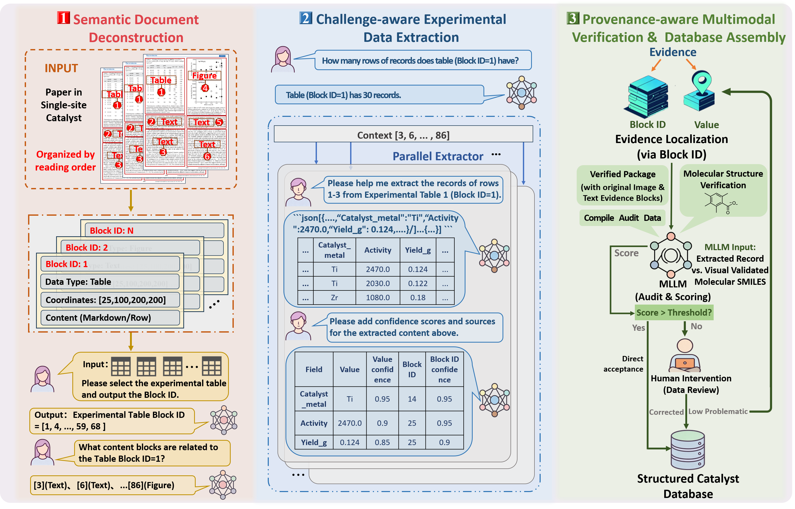
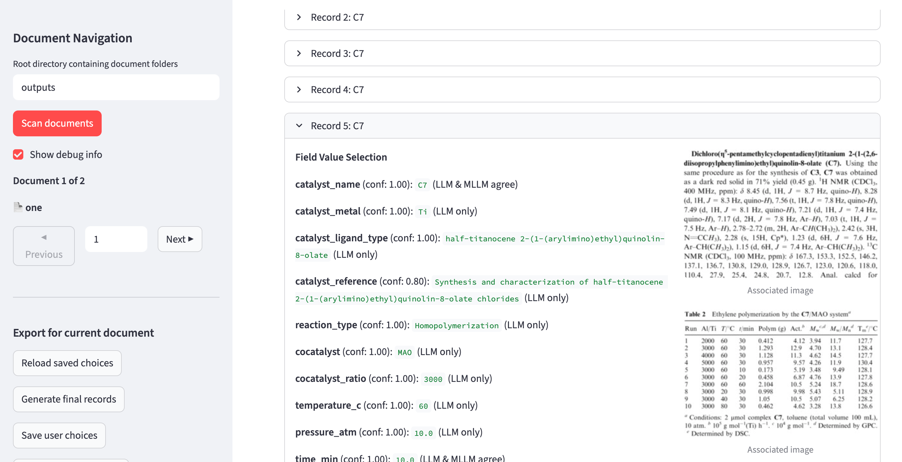
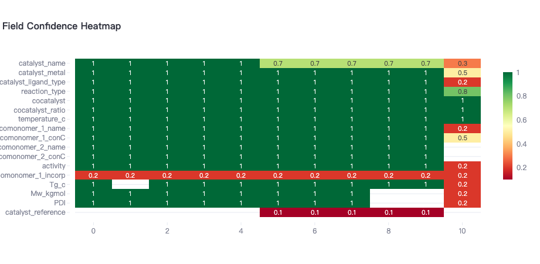

# CREST (Chemical Record Extraction with Source Tracking)

## 📖 Overview

**CREST** establishes an end-to-end processing pipeline encompassing precise experimental table localization, dynamic structural partitioning, and context-aware semantic interpretation. This pipeline culminates in the automated extraction of experimental records with high fidelity and full traceability, guaranteeing that the structured extraction process retains both a macro-level overview and fine-grained local accuracy.

## 🏗️ Architecture

  
*Figure: Overall architecture of the CREST pipeline – from document ingestion to structured, traceable records.*

## 📊 Evaluation


## Quick Start

- We provide a default schema with 34 fields designed for metallocene catalyst extraction. If you would like to use your own schema, you are welcome to update the YAML file with your custom definition — we’ve made it easy to swap in your own fields.

- For now, our pipeline works with PDFs that have been pre-processed by MinerU. Please kindly run MinerU (https://opendatalab.github.io/MinerU/) on your documents before starting the extraction; we appreciate your cooperation.

```
python3 pipeline.py -c configs/config.yaml
```

If you wish to quickly obtain extraction results without performing reverse indexing and verification, or if you encounter low‑quality document images (e.g., due to text/table recognition issues) and would like to leverage an MLLM (Multi‑modal Large Language Model) to assist in validating content correctness, you can set `use_confidence` to `false`:
  ```yaml
  use_confidence: false,
  use_evidence: false

  ```

## Interactive Interface

- Given the complex and diverse forms of chemical data such as formulas and nomenclature, we have developed a user‑friendly interactive interface to facilitate expert review. When consensus is reached, the results can be saved directly.

```
streamlit run app/interface.py
```



- If there is disagreement during review, the file can be modified accordingly. Moreover, the confidence visualization chart allows for quick identification and inspection of erroneous samples.




## validation

We provide 48 PDF files of test data along with their layout extraction results, which can be used to evaluate the performance of the extraction system. In addition, we supply annotated data for a subset of experimental tables, enabling the assessment of the extraction outputs. In the annotation, "data_id" denotes the experimental data extracted from a specific experimental table, "index" indicates the start and end rows of the experimental record, and the corresponding "data" represents the ground truth of the extracted experimental record. 


